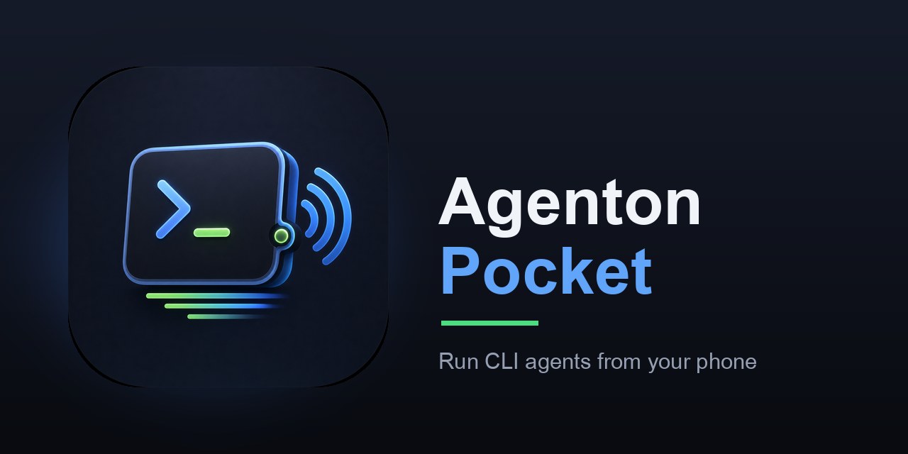

<p align="center">
  
</p>

<p align="center">
  <a href="https://github.com/nduwork/agenton-pocket/actions/workflows/ci.yml"></a>
  <a href="LICENSE"></a>
</p>

Run `claude` / `codex` / any CLI agent in daemon-owned sessions, and drive them
from wherever you are: a minimal TUI at the desk, a tap-friendly web client on
your phone. Sessions survive detach, replay scrollback on reattach, and can be
watched from both clients at once. The daemon + wire protocol are designed to
be reused unchanged by a future native iOS client.

## Quickstart

### 1. Set up Tailscale first

agenton reaches your phone over [Tailscale](https://tailscale.com), so configure
that **before** running agenton — `agenton vpn` publishes over your tailnet and
has nothing to bind to without it ([why](#why-tailscale)). One-time, on both
devices:

1. **Computer** — install Tailscale (`brew install tailscale`, or the
   [download](https://tailscale.com/download)), open the app, and log in.
2. **Phone** — install Tailscale from the App Store / Play Store, log in with
   the **same account**, and flip the VPN toggle **on**.

Both devices are now on one private network; day to day you just leave the
toggle on. (Don't want Tailscale? If your phone is on the same Wi-Fi, skip this
and use `agenton lan` to reach it over the local network instead.)

### 2. Install agenton

No clone needed — pick whichever fits. One-liner (macOS / Linux), fetches a
prebuilt binary:

    curl -fsSL https://raw.githubusercontent.com/nduwork/agenton-pocket/main/install.sh | bash

Go users:

    go install github.com/nduwork/agenton-pocket/cmd/agenton@latest

Linux `.deb` / `.rpm` packages are on the
[releases page](https://github.com/nduwork/agenton-pocket/releases)
(`sudo apt install ./agenton_*_amd64.deb`).

From a clone, the same installer runs interactively:

    ./install.sh

It asks where to put the binary, defaulting to `/usr/local/bin`:

    Install agenton to [/usr/local/bin]:

Press enter to accept, or type any directory (`~` works). It fetches a prebuilt
release, or builds from source if Go is present and no release matches. To skip
the prompt — for scripts, or `curl … | bash`, which never prompts — name the
directory up front:

    ./install.sh -d ~/.local/bin        # or AGENTON_INSTALL_DIR=~/.local/bin

### 3. Run it

From anywhere (with the Tailscale app running from step 1):

    agenton vpn

That starts everything: the daemon, the web server, and drops you into the TUI.
It publishes the phone bridge over your tailnet and prints a QR — no extra
config, nothing to approve. (On the same Wi-Fi and don't want Tailscale? Use
`agenton lan` instead, which publishes this machine's LAN IP.)

You pick the reach — `vpn` or `lan` — once, when starting. After that, bare
`agenton` resumes the session (reopens the TUI); quitting the TUI leaves the
daemon, web server, and all sessions running. `agenton stop` ends everything. A
start flag is refused while agenton is already up, so the reach never changes
mid-run.
Logs land in `~/.local/state/agenton/`.

Headless (a server that only needs daemon + web): `agenton vpn -no-tui`.

Prefer to build by hand? `go build -o agenton ./cmd/agenton` still works; run it
as `./agenton`.

## Phone access (Tailscale)

### Why Tailscale

agenton speaks plain HTTP and exposes nothing to the internet. Instead it rides
your **tailnet** — a private [Tailscale](https://tailscale.com) mesh VPN
(WireGuard) that puts your computer and phone on the same encrypted network no
matter where either one physically is. On the couch, on cellular, or across the
country, the phone reaches your daemon exactly as if both were on your home
Wi-Fi. The tailnet *is* the security boundary: only devices logged into *your*
account can reach the port, and the wire is encrypted for you.

agenton uses the **system Tailscale app** already on the computer — it registers
no tailnet node of its own, so there's nothing to approve, no login link, and it
works on the **free** plan. Install it once on both devices ([Quickstart step
1](#1-set-up-tailscale-first)).

### Connect (every day)

    agenton vpn -no-tui   # binds the computer's tailnet IP and prints a connect QR

On the phone, open the agenton iOS app, tap ⚙︎ → **Scan QR**, and scan the block
it printed. Reprint any time with `agenton qr`.

**No app?** The server also hosts a web client. Open the printed `http://…`
URL in any browser on your tailnet, or run `agenton qr --web` for a QR of that
URL you can scan with the phone's plain **Camera** (it opens straight in the
browser — no scheme, no app). To make it feel like an app, use the browser's
Share → **Add to Home Screen** for a full-screen launcher icon.

Modes (pick one when starting):
- `agenton vpn` — over the tailnet via the system Tailscale app, reachable anywhere.
- `agenton lan` — over the local network: publishes this machine's LAN IP, so
  phones/browsers on the same Wi-Fi can reach it. No tailnet.

Once running, bare `agenton` resumes the session and `agenton stop` ends
everything (daemon, web, all sessions). A start flag is refused while agenton is
already up, so the reach never changes mid-run.

## Using the TUI

The TUI is a minimal terminal *wrapper*: at the desk you type to the agent
directly, and the TUI just adds session switching on top.

Entry screen (session list): `enter` attach · `n` new session · `d` delete ·
`r` refresh · `q` quit. `n` opens a plain shell in the directory you launched
the TUI from — you run `claude`/`codex` (or anything) inside it, `cd`-ing
wherever you like first. The list auto-refreshes, so sessions you start or kill
from the phone/web client show up on their own, and each row's path tracks
where its agent is actually running (the shell's live working directory), not
where the session was first opened.

Session view: a full-screen raw terminal with no chrome — every key goes
straight to the PTY, exactly as if you'd launched the shell here. The one
reserved key is `ctrl+t`, which returns to the session list to switch sessions
(the session keeps running, so it doubles as detach). The on-screen button pad
and custom-key rebinding live on the phone/web clients, where there's no
physical keyboard to type with.

**Scrolling & copying.** Mouse-wheel up/down pages through session history — at
a shell you scroll agenton's scrollback; inside `claude`/`codex` the wheel
scrolls their own view. To **select and copy** text, hold your terminal's
selection modifier and drag — **Option+drag** in iTerm2/Ghostty, **Shift+drag**
in most Linux terminals and macOS Terminal. Scroll the history into view first,
then modifier-drag to copy from it.

## Using the web client

Mobile-first mirror of the TUI: session list (tap to attach, ✕ to kill, new
sessions via a command + cwd form), live terminal, a 4×3 button pad
(accept / reject / mode / stop · ▲ ▼ ◀ ▶ · esc / rewind / 2 custom), and a
text bar. The `Pad`/`Term` button switches between **Terminal** (the phone
owns the PTY size, terminal renders correctly) and **Controller** (the desk
owns it; the phone becomes a full-screen button pad instead of a shrunk
frame) — the phone parks itself into Controller automatically when you start
typing at the desk.

- **New-session suggestions**: chips above the form — sessions currently
  running under the daemon, agent processes discovered elsewhere on the host
  (`claude`/`codex`/`cortext`/`ollama run`, clonable but not attachable),
  your recent commands (per-device), then starters. Tap to fill, edit, go.
- **Rebind custom buttons**: long-press Custom 1/2 → tap-to-compose picker
  (chips for keys/combos, text field for literal strings) — no combo typing
  on a phone.

## Shared sessions

The TUI and web client are two views of the same daemon: create a session in
either, attach from both at once — output streams live to every attached
client. Exactly one client owns the PTY size at a time (the "active" device):
it renders the live terminal, and everyone else parks into a purpose-built
role instead of showing a mis-sized frame — the desk TUI freezes its last
frame behind a "press any key to take over" hint, and the phone clients (web
and iOS) flip to Controller mode. Buttons and text still work while parked;
they drive the agent without stealing the size.

## Configure (optional)

Presets pin an agent + cwd + custom buttons under a name:

    mkdir -p ~/.config/agenton
    cat > ~/.config/agenton/config.toml <<'EOF'
    [preset.api-refactor]
    agent   = "claude"
    cwd     = "~/repos/api"
    command = "claude"

    # Only the two custom buttons are configurable; accept/reject/mode/
    # interrupt/rewind are fixed per agent (claude/codex/shell), detected
    # from the session's command line. Each custom button holds one value:
    # a key name / combo (Ctrl+O, Shift+Tab, Esc, ...) or a literal string.
    [preset.api-refactor.buttons]
    custom_1    = "Ctrl+O"
    custom_2    = "/compact"
    EOF

## Commands

    agenton vpn           # start over your tailnet (Tailscale), then open the TUI
    agenton lan           # start over your local network (LAN IP), then open the TUI
    agenton                 # resume the running session (open the TUI)
    agenton vpn -no-tui   # start daemon + web only (headless/server)
    agenton tui             # just the TUI (daemon must be running)
    agenton web             # just the web server (default 127.0.0.1:9787)
    agenton daemon          # just the daemon (socket at ~/.agenton/agenton.sock)
    agenton qr              # publish over Tailscale + print the iOS connect QR
    agenton stop            # stop the daemon + web (ends all sessions)
    agenton help            # top-level usage (`agenton <cmd> -h` for a command's flags)

## Test

    go test ./...             # unit + e2e (local, simulated-remote, WS bridge)

Hacking on it? `./dev.sh` rebuilds, restarts the daemon + web, and installs a
fresh iOS build on a simulator pointed at it. The steps are independent —
`./dev.sh ios` leaves your running sessions alone, `./dev.sh -h` lists the rest.
Note the web client is embedded in the binary, so editing `internal/web/static/`
needs a rebuild + restart, not just a browser reload.

## Architecture

```
TUI (Bubble Tea) ────Unix socket────┐
phone browser ⇄ WS ⇄ agenton web ───┴──> daemon (owns PTYs) ──> claude / codex / …
```

Wire frame: `[1 type][4 session_id][4 len][payload]`; `0x01`=control JSON,
`0x02`=raw PTY bytes. One WS binary message = one frame. The daemon listens on
a Unix socket only and never opens a public port; remote access rides your
tailnet (the web server binds the machine's tailnet IP, never `0.0.0.0`).
Sessions persist across detach (daemon-owned PTYs + scrollback ring buffer);
reattach replays scrollback then streams live output.

## Design docs

The architecture is summarized above (protocol, daemon, transport); phone setup
is covered under [Phone access](#phone-access-tailscale).

## License

Copyright © 2026 Niu Du. Licensed under GPL-3.0 — see [LICENSE](LICENSE).

All source in this repo — daemon, web, **and** the iOS app (`ios/`) — is free
software under GPL-3.0; build and run it yourself (the iOS app runs in the
Simulator with no Apple account). The only thing that isn't the GPL code is the
**signed App Store binary**: a paid convenience published from the maintainer's
private signing pipeline. This dual arrangement works because all copyright is
held by one author; outside contributions are accepted under a
[CLA](.github/CONTRIBUTING.md) so that right is preserved.

Changes are proposed by **fork and pull request** — fork the repo, push to your
fork, and open a PR. Direct push access isn't granted; see
[CONTRIBUTING](.github/CONTRIBUTING.md). The repo is hosted in the
`nduwork` workspace, but copyright is held by Niu Du personally.

Third-party licenses (bundled Go modules, including the Tailscale client under
BSD-3-Clause): see [THIRD_PARTY_LICENSES.md](THIRD_PARTY_LICENSES.md).
